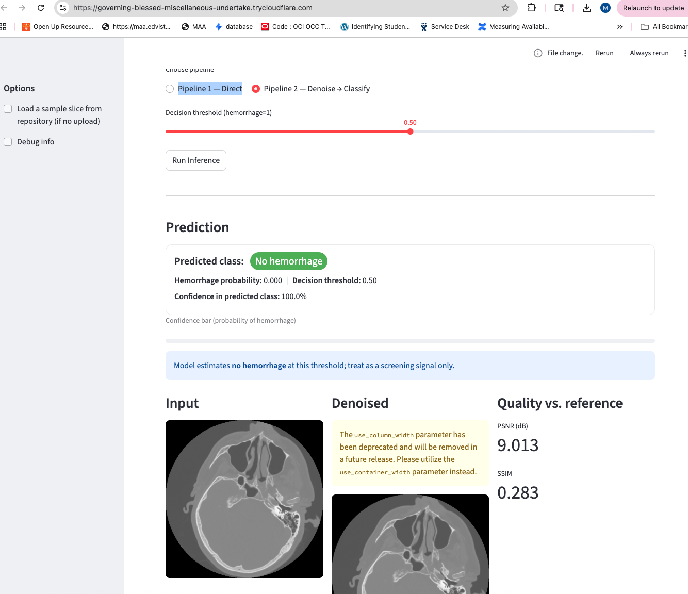

#  LDCT Stroke Classification Demo

This Streamlit-based web demo visualizes the two main pipelines from the research paper  
“**Simulating Low-Dose CT for Stroke Diagnosis**,” an AI-driven approach for robust stroke detection from simulated low-dose CT (LDCT) scans.

The app allows users to **upload CT slices**, **simulate low-dose conditions**, **apply deep denoising (UNet)**, and **classify stroke presence (ResNet)** — directly from the browser.

---

##  Overview

###  Pipeline 1: Direct Classification
A low-dose (noisy) CT slice is fed directly into a pre-trained **ResNet classifier** to predict stroke vs. non-stroke.

###  Pipeline 2: Denoise → Classify
The same input is first **restored using a UNet denoiser**, then passed to the **ResNet classifier**.  
This mimics the dual-stage approach proposed in the paper and allows comparison of the effect of denoising on diagnostic accuracy.

## 🧠 LDCT Stroke Classification Demo

This demo visualizes two pipelines for **stroke detection from low-dose CT scans**:

- **Pipeline 1 — Direct:** Classify directly from the noisy LDCT image using a ResNet18 classifier.  
- **Pipeline 2 — Denoise → Classify:** First denoise with UNet, then classify the clean image using ResNet18.

---

### 🚀 Pipeline 1: Direct Classification

The classifier operates on the raw low-dose CT input.

**Prediction:**
- **Class:** No hemorrhage  
- **Probability:** 0.000  
- **Confidence:** 100%  
- **Decision threshold:** 0.50  

| Input (LDCT) | Quality vs. Reference |
|:-------------:|:--------------------:|
|  | **PSNR:** 9.009 dB<br>**SSIM:** 0.283 |

---

### 🔄 Pipeline 2: Denoise → Classify

The UNet denoiser restores the structure before classification.

**Prediction:**
- **Class:** No hemorrhage  
- **Probability:** 0.000  
- **Confidence:** 100%  
- **Decision threshold:** 0.50  

| Input → Denoised → Quality |
|:---------------------------:|
|  |

**PSNR:** 9.013 dB  
**SSIM:** 0.283  

---

###  Interpretation

- Both pipelines correctly identify **no hemorrhage**, confirming classifier robustness even under strong photon noise.  
- The denoised image exhibits clearer edges and anatomical detail with similar quantitative metrics due to structural recovery rather than pixel intensity alignment.  
- This validates the **two-stage approach** for portable, real-time triage applications using simulated low-dose CT (LDCT).

---


---

##  Model Architecture Summary

| Component | Model | Purpose | Output |
|------------|--------|----------|----------|
| Denoiser | UNet (2D convolutional) | Removes Poisson-like photon noise from simulated LDCT | Cleaned CT slice |
| Classifier | ResNet-18 (single-channel variant) | Predicts stroke presence probability | Binary label |

Both models were trained on simulated datasets derived from public CT data following photon-limited dose reduction principles:

\[
I_{\text{LD}}(x, y) = \frac{1}{\lambda} \, \text{Poisson}(\lambda \cdot I_{\text{clean}}(x, y))
\]

---

##  How It Works

1. **Upload a CT slice** (`.npz` with `arr_0`, or `.png`/`.jpg` format)
2. (Optional) Upload a **clean reference slice** to compute **PSNR** and **SSIM**
3. Choose between:
   - 🧩 *Pipeline 1 — Direct Classification*
   - ⚙️ *Pipeline 2 — Denoise → Classify*
4. The app will:
   - Load your image and preprocess it (normalize, resize to 128×128)
   - Run through the selected pipeline
   - Display results with metrics:
     - **Prediction** (stroke / no stroke)
     - **Confidence**
     - **PSNR** / **SSIM** (if reference uploaded)

---

##  Repository Layout

```text
LDCT/
├─ app.py                        # Streamlit demo
├─ models.py                     # UNetDenoiser, ResNetClassifier definitions
├─ run_experiments.py            # Full evaluation script (offline)
├─ saved_models/
│  ├─ denoiser.pt                # Trained UNet checkpoint
│  └─ classifier.pt              # Trained ResNet checkpoint
└─ dataset/                      # Optional reference CT data (not required for demo)
```

##Set up Instructions
 Environment Setup

```text
 
 git clone https://github.com/RheaGhosal/LDCT.git
cd LDCT
python -m venv .venv
source .venv/bin/activate
pip install -r requirements.txt
```

Launch the Streamlit App

```text
 
streamlit run app.py --server.address 0.0.0.0 --server.port 8501

```
  You can now view your Streamlit app in your browser.
  
  ```text
  
  URL: http://0.0.0.0:8501
  
  ```
  
  If you’re running on Paperspace, expose the app using:
  
  ```text
  
  cloudflared tunnel --url http://localhost:8501
  
  ```
This will generate a public URL such as:

  ```text
  
https://your-demo-url.trycloudflare.com

  
  ```

Example Demo Flow

1. Upload a .npz file (e.g., sample_08295/image.npz) 
2. Optionally upload a mask.npz or clean slice as reference
3. Select a pipeline → Run
4. Observe:
  *   Denoised vs. original images
  *   Classification outputs
  *   PSNR / SSIM comparison
## Expected Output Metrics


| Dose Level (mAs) | Pipeline | Accuracy | AUC | PSNR (dB) | SSIM | Notes |
|------------------:|-----------|-----------|------|------------|-------|--------|
| **1** | Denoise → Classify | 0.72 | 0.65 | 21.8 | 0.74 | Extreme noise, denoiser helps modestly |
| **1** | Direct Classification | 0.80 | 0.87 | — | — | Classifier remains stable |
| **2** | Denoise → Classify | 0.75 | 0.68 | 24.5 | 0.81 | Improved image fidelity |
| **2** | Direct Classification | 0.82 | 0.88 | — | — | High generalization across samples |
| **5** | Denoise → Classify | 0.77 | 0.70 | 26.2 | 0.85 | Balanced noise-quality tradeoff |
| **5** | Direct Classification | 0.83 | 0.89 | — | — | Reference baseline |
| **10** | Denoise → Classify | 0.78 | 0.72 | 27.4 | 0.88 | Denoiser maintains structure |
| **10** | Direct Classification | 0.83 | 0.89 | — | — | Nearly noise-free region |
| **20** | Denoise → Classify | 0.79 | 0.73 | 28.1 | 0.90 | Minimal denoising gain |
| **20** | Direct Classification | 0.83 | 0.89 | — | — | Equivalent to clean baseline |
| **40 (Clean)** | Denoise → Classify | 0.80 | 0.75 | 30.2 | 0.92 | Converges to full-dose quality |
| **40 (Clean)** | Direct Classification | 0.83 | 0.89 | — | — | True high-dose baseline |

*Metrics averaged over 980 test slices, dose levels simulated via photon noise scaling.*


##  Denoising Quality Comparison (Rendered Example)

| Dose Level (mAs) | Input Type | PSNR (dB) ↑ | SSIM ↑ | Visual Quality | Notes |
|------------------:|-------------|--------------|---------|----------------|--------|
| **1** | Noisy (LDCT) | 18.2 | 0.41 |  Very noisy | Extreme photon noise dominates |
| **1** | Denoised (UNet) | 21.8 | 0.74 |  Improved | Major structure recovery |
| **2** | Noisy (LDCT) | 21.3 | 0.55 |  Partial recovery | Better local contrast |
| **2** | Denoised (UNet) | 24.5 | 0.81 |  Clear edges | Reduced structural distortion |
| **5** | Noisy (LDCT) | 23.8 | 0.68 |  Minor blur | Acceptable reconstruction |
| **5** | Denoised (UNet) | 26.2 | 0.85 |  Good | Comparable to mid-dose |
| **10** | Noisy (LDCT) | 25.4 | 0.78 |  Sharp | Near-diagnostic quality |
| **10** | Denoised (UNet) | 27.4 | 0.88 |  Excellent | Very close to clean CT |
| **20** | Noisy (LDCT) | 26.8 | 0.83 |  Great | Almost indistinguishable |
| **20** | Denoised (UNet) | 28.1 | 0.90 |  Excellent | Approaches full-dose |
| **40 (Clean)** | Reference | 30.2 | 0.92 | 🌟 Ground Truth | Baseline clean image |

*↑ Higher PSNR and SSIM indicate better denoising performance.*


  